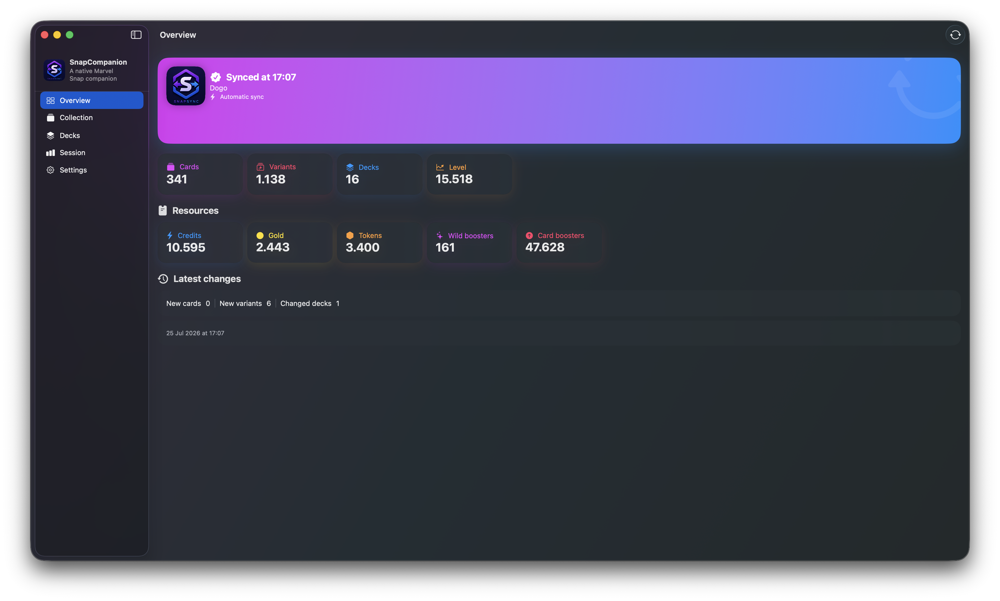
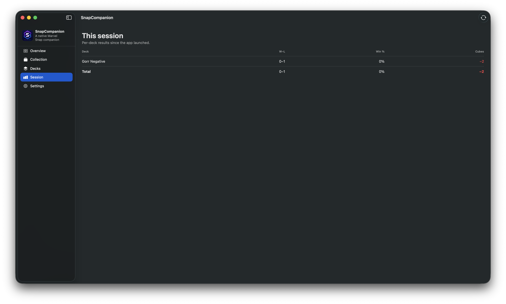
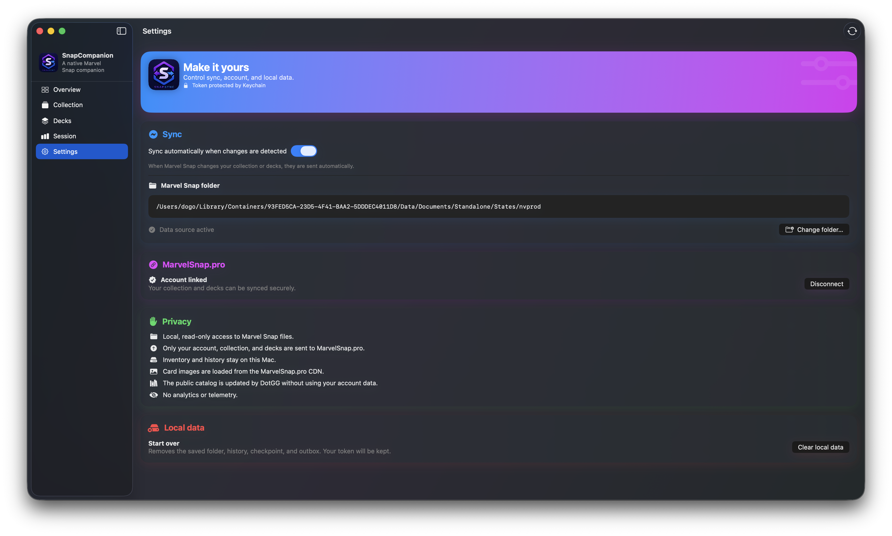
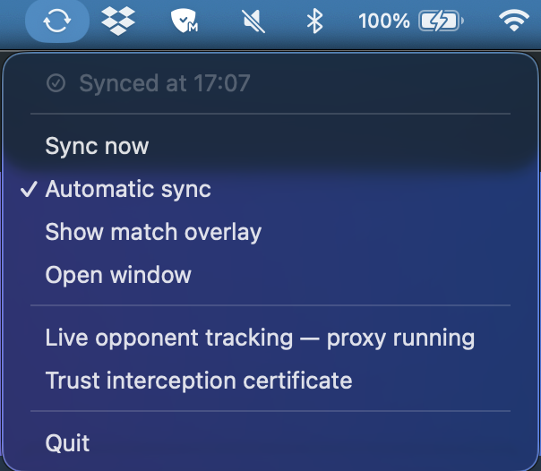

# SnapCompanion

A native macOS companion for Marvel Snap. It reads your local game data to browse your collection and decks and sync them with MarvelSnap.pro — and it can show a **live overlay of your opponent's cards and likely deck** during a match.

> Unofficial community project. Not affiliated with or endorsed by Marvel, Second Dinner, Nuverse, or MarvelSnap.pro.

## Screenshots



| Live opponent overlay | Session stats |
|---|---|
|  |  |

| Collection | Decks |
|---|---|
|  |  |

| Settings | Menu bar |
|---|---|
|  |  |

## Two things it does

- **Collection, decks & sync** — reads `ProfileState.json` and `CollectionState.json` locally (never modifying them) and keeps your account, collection, and decks in sync with MarvelSnap.pro.
- **Live opponent overlay** (opt-in, experimental) — during a match, a floating overlay shows the opponent's revealed cards, a predicted archetype with a confidence score, a bot flag, the turn, the locations, the live cube value and snap count, and the win/loss result. See [Live opponent tracking](#live-opponent-tracking).

## Features

**Collection & decks**
- Automatic discovery of the `States/nvprod` directory; manual folder selection with a read-only security-scoped bookmark.
- Versioned parsing of account, collection, variants, and decks.
- Searchable collection browser: owned/missing filters, grayscale for missing cards, sorting, per-card details, cached artwork.
- Deck browser with artwork and full card contents.
- Meta deck recommendations ranked by owned cards, including incomplete decks with missing cards highlighted.
- Local inventory: collection level, currencies, and boosters.
- Private lightweight history of the latest collection/deck change.

**Sync**
- Manual and automatic sync with debounce, retry, idempotency, and an offline outbox.
- Keychain-stored MarvelSnap.pro token; in-app disconnect and local data cleanup.
- Sanitized diagnostics via `snapsync doctor`.

**Live opponent overlay**
- Opponent name and bot detection (MarvelSnap.pro's known-AI lists).
- Revealed cards, updated live as they're played.
- Deck prediction from MarvelSnap.pro archetypes, with a confidence score and top candidates.
- Current turn and the three locations, with real art.
- Live cube value and snap count, and a win/loss result with cubes won or lost.

**Platform**
- Native SwiftUI dashboard and menu bar controls.
- English and Brazilian Portuguese (String Catalog).
- Developer ID signing and Apple notarization (Fastlane + Match).

## Install

Download the latest `SnapCompanion.dmg` from [Releases](https://github.com/dogo/SnapCompanion/releases), drag the app to `/Applications`, and open it. The collection, deck, and sync features work right away; the live overlay needs the one-time setup below.

## Live opponent tracking

The overlay reads the current match from the game's realtime connection through a bundled **system extension** that intercepts only the Marvel Snap process's TLS, on your Mac. It terminates and re-originates that TLS locally to read the match state and forwards the traffic unchanged — nothing leaves your machine.

One-time setup:

1. Open SnapCompanion → menu bar → **Live opponent tracking**. Approve the system extension when macOS prompts (System Settings → General → Login Items & Extensions → Network Extensions). On first enable the extension generates a **unique CA + leaf for this install**.
2. The app trusts that CA for you (user trust domain) — approve the one **keychain prompt** macOS shows. No Terminal, no `sudo`. If it's ever missed, menu bar → **Trust interception certificate** re-runs it.
3. Menu bar → **Show match overlay**, then start a Marvel Snap match.

> Experimental. The CA is generated per install and its private key is discarded immediately after signing the one leaf; only the leaf key persists, in the extension's private container. Nothing secret is bundled with the app. The cube value and snap count come from the same WebSocket, and the match result from the local `GameState.json`; the game's HTTP/2 API channel is certificate-pinned and left untouched.

## Build (development)

Requirements: macOS 13+, Swift 6.2+, Tuist 4.202.6 (via Mise), a local Marvel Snap install, and a MarvelSnap.pro account for uploads.

Core and CLI:

```bash
swift build
swift test
```

App:

```bash
mise install
mise exec -- tuist generate
```

Then run the `SnapCompanionApp` scheme in Xcode. String Catalog symbols and localized resources are generated by the build.

Bundle or DMG (written to the ignored `dist/`):

```bash
./scripts/build_app.sh
./scripts/build_dmg.sh
```

## CLI

```bash
swift run snapsync discover
swift run snapsync inspect
swift run snapsync export --output snapshot.json
swift run snapsync connect
swift run snapsync sync --dry-run
swift run snapsync sync --confirm
swift run snapsync watch --confirm
swift run snapsync doctor
```

Add `--path <nvprod>` to point at a manually selected source directory.

## Privacy

Collection and sync read `ProfileState.json` and `CollectionState.json` locally; inventory and history stay on the Mac. Sync sends only the account, collection, deck, and authentication data MarvelSnap.pro needs. The token stays in the macOS Keychain and private values are excluded from logs and diagnostics.

The live overlay intercepts and re-originates only the Marvel Snap process's TLS, locally, to read match state — the traffic is forwarded unchanged and nothing is sent anywhere.

See [PRIVACY.md](PRIVACY.md) for the full data-handling policy.

## Release

Credentials are never committed. After configuring the local Matchfile and the `SnapSync-notary` Keychain profile:

```bash
mise install
mise exec -- bundle install
mise exec -- bundle exec fastlane mac release
```

See [DISTRIBUTION.md](DISTRIBUTION.md) for the complete flow.

## Project

Milestone and remaining work: [ROADMAP.md](ROADMAP.md). Available under the [MIT License](LICENSE).
